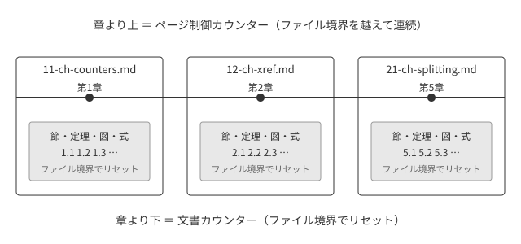

# カウンターの設計 {#ch-counters}

番号の出所を階層で分け、その境界をファイル分割の境界に一致させます。実装は `theme/book.css` の 3〜5 節です。

## 章より上 — ページ制御カウンター {#sec-counters-above}

`@page` 規則の中に書いた `counter-increment` は、出版物全体で連続します。これを Vivliostyle の `:nth()` ページセレクタと組み合わせます。

```css
body.chapter { page: chap; }
@page chap:nth(1 of chap) { counter-increment: chapter; }
```

`@page 名前:nth(1 of 名前)` は**各ページグループの先頭**にマッチします[^group]。

[^group]: ページグループの切れ目は「文書の切り替わり」か「強制改ページ」で決まります。

ページグループは「文書の切り替わり」か「強制改ページ」で区切られるので、1ファイル1章でも、1ファイルに複数章を入れても、同じ CSS で通し番号になります。

<div class="rem">
<p><code>@page :first</code> は出版物全体の最初の1ページにしかマッチしません。
「各ファイルの1ページ目」を狙うときは <code>@page :nth(1)</code> です。</p>
</div>

この章の見出しに出ている章番号も、部の扉の部番号も、付録の記号も、すべてこの仕組みで振られています。

## 章より下 — 文書カウンター {#sec-counters-below}

節・定理・図・式は章ごとにリセットされてほしいものです。**1ファイル1章にすれば、ファイル境界のリセットがそのまま望みの挙動になります。**制約と要求が一致している場所です。

### 節番号は入れ子カウンターで {#sec-counters-nested}

要点は、リセットを見出しではなく**見出しの次の要素**に置くことです。見出しの位置ではまだ親の階層なので、見出しには親までの番号が出ます。

```css
section.level2, section.level3 { counter-increment: sec; }
section > :is(h1,h2,h3,h4,h5,h6):first-child + * { counter-reset: sec; }
h2::before, h3::before { content: counter(chapter) '.' counters(sec, '.'); }
```

見出し自身にリセットを書くと、章番号のあとに `1.0` のような余分な桁が出ます。この節の番号が3階層で出ているのが、正しく書いた結果です。

### counter-reset は必ず書く {#sec-counters-reset}

`counter-increment` だけ書いて `counter-reset` を書かないと、**増やす要素ごとに別のカウンターが作られます。**有効範囲は「その要素と、その後ろの兄弟（とその子孫）」だけなので、**兄弟同士に並んでいるうちは偶然うまくいき、節をまたいだ時点で 1 に戻ります。**CSS の規定どおりの挙動で、Vivliostyle の不具合ではありません。

書き忘れても、原稿の並びによっては症状が出ません。**出たころには原稿の分量が増えていて、手直しが重くなっています。**

theme-base を使っているときは、`body { counter-reset: … }` を直接書いてはいけません。同じセレクタで上書きすると theme-base 側の `vs-counter-*` のリセットが全部消えます。用意されている変数に足します。

```css
:root { --vs-document-root-counter-reset: thmlike eq; }
```

この本では[](#thm-scope){.ref-thm}がその証拠です。

## 定理環境 {#sec-counters-theorem}

定理・補題・命題・系・定義は、**ひとつの番号系列を共有するか、種類ごとに分けるか**を選べます。この本は共有する側にしています（LaTeX の `\newtheorem{lemma}[theorem]{補題}` にあたります）。

<div class="dfn" id="dfn-page-counter">
<p><strong>ページ制御カウンター</strong>とは、<code>@page</code> 規則の中で
<code>counter-increment</code> / <code>counter-reset</code> / <code>counter-set</code> を
受けたカウンターのこと。文書カウンターとは別系統として扱われ、出版物全体で連続する。</p>
</div>

<div class="thm" id="thm-crossfile" data-name="ファイル境界の定理">
<p>ページ制御カウンターはファイル境界を越えて連続し、文書カウンターはリセットされる。</p>
</div>

<div class="lem" id="lem-nofix">
<p><code>@page { counter-increment: X 0 }</code> と書いて要素カウンターをページ制御下に
置いても、ファイルはまたげない。</p>
</div>

<div class="cor" id="cor-nogeneral">
<p>「ファイルをまたいで、要素ごとに1つ進む番号」は CSS だけでは作れない。</p>
</div>

[](#dfn-page-counter){.ref-thm}から[](#cor-nogeneral){.ref-thm}まで、定義・定理・補題・系が種類をまたいで通し番号になっているのが、系列を共有しているということです。

<div class="thm nonum">
<p>番号を持たない定理も入れることができます。<code>counter-increment: none</code> で上書きすれば、
系列は乱れません。次の定理に番号が続きます。</p>
</div>

<div class="thm" id="thm-after-nonum">
<p>実際に、無番号の定理を挟んでも番号が続いています。</p>
</div>

## 図と式 {#sec-counters-figure}

{#fig-counters-layer}

**図の id は `<figcaption>` に付けます**（VFM の `assignIdToFigcaption: true`）。[](12-ch-xref.md#thm-id-placement){.ref-thm}と[](12-ch-xref.md#thm-target-text){.ref-thm}の両方から出てくる置き方です。

図の番号は `<figure>` で増えるので、その子である `<figcaption>` の位置ではもう増えたあとです。番号はずれません。逆に増える要素より**手前**に id を置くと、まだ増える前の値を返して1つずれます。そのうえで `target-text()` で参照するとき、`<figure>` を指すと画像の代替文や表の中身まで混ざるので、キャプションだけを持つ `<figcaption>` である必要があります。

式も同じ考え方で、番号を出す要素そのものに id を置きます。

<div class="thm" id="thm-scope">
<p>この定理は定理環境の節ではなく図と式の節にあるが、番号は前の節の続きになっている。
<code>counter-reset</code> を書いてあるからである。</p>
</div>

<div class="eq" id="eq-counters-1"><span>chapter = ページ制御カウンター</span></div>

<div class="eq" id="eq-counters-2"><span>sec, thmlike, fig, eq = 文書カウンター</span></div>

## 前付けと本文でページ番号の系列を分ける {#sec-counters-pagenum}

前付けはローマ数字、本文はアラビア数字にしたいとき、`page` カウンターを振り直す方法は避けます。**振り直しを置いた文書が1ページしかないと、次の文書に引き継がれません。**

系列ごとに別のページ制御カウンターを立てれば、この罠に引っかかりません。

```css
@page front { counter-increment: frontpage;
              --vs-page--mbox-bottom-center-content: counter(frontpage, lower-roman); }
@page part, chap, app, back, colo { counter-increment: bodypage;
              --vs-page--mbox-bottom-center-content: counter(bodypage); }
```

この本のまえがきが `i`、本文が `1` から始まっているのがそれです。前付けと本文はそもそも別の系列なので、実装としてもそう書くほうが素直です。

## 目次に出したくない節 {#sec-counters-hidden-nx}

見出しの id の末尾を `-nx` にすると、この節は目次にも PDF のしおりにも出ません。規約の作り方は[](22-ch-toc.md#ch-toc){.ref-ch}で述べます。本文の節番号は普通に振られています。
