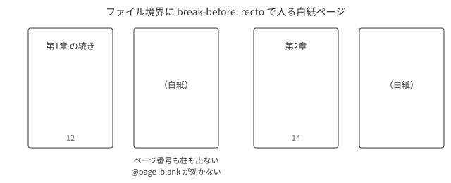

# 落とし穴の一覧 {#app-pitfalls}

Vivliostyle の壊れ方は、エラーではなく**沈黙**です。どれも目視では気づけません。

## 静かに壊れるもの {#sec-pitfalls-silent}

| 間違い | 起きること |
| --- | --- |
| 参照先の id を書き間違えた | `??` が出てビルドは成功する |
| `entry` に書き忘れた | その章が本から消える。ログにも出ない |
| 表紙のエントリに `theme` を書かなかった | 表紙のページだけ判型と余白が違う |
| `@page A, @page B` と書いた | その規則だけ無視される（正しくは `@page A, B`） |
| ページ番号の振り直しを1ページの文書に置いた | 次の文書に引き継がれない |
| 目次の `<li>` を直接入れ子にした | 印刷は正しいのに、しおりだけ壊れる |
| 判型を指定しなかった | `theme-base` の既定は `auto` なので Letter で出る |
| 図の id を `<figure>` に付けた | 参照した番号だけ1つずれる |
| 柱に前方参照を置いた | 最初のページ以外は `??` のまま残る |
| 段落の途中で改行した | その位置に半角スペースが出る（原稿は1段落1行で書く） |
| 脚注定義の直後に空行を置き忘れた | 次の段落が脚注本文に取り込まれる |
| 脚注の呼び出しが満杯ページの末尾に来た | 脚注が次ページへ繰り延べられ、ページ番号に重なる |

## 判型 {#sec-pitfalls-size}

`@vivliostyle/theme-base` の `--vs-page--size` の既定は `auto` です。何も書かないと Letter で出ます。設定の `size: 'A5'` で指定するのがいちばん素直です。

<div class="rem">
<p><code>pdfinfo</code> は既定で<strong>1ページ目の判型しか表示しません</strong>。
ページごとに違うことがあるので、確かめるときは
<code>pdfinfo -l &lt;総ページ数&gt;</code> を使います。</p>
</div>

## 表紙 {#sec-pitfalls-cover}

CLI が生成する表紙 HTML には、エントリに `theme` を書かないとスタイルシートが1枚も入りません。しかもエントリの `theme` は全体の `theme` を**置き換える**ので、全部並べ直す必要があります。

```js
{ rel: 'cover', theme: ['@vivliostyle/theme-base', './theme/book.css', './theme/cover.css'] }
```

## ファイル境界の白紙ページ {#sec-pitfalls-blank}

`break-before: recto` で入る白紙ページは、**ファイル境界に入ったものだけ完全な白紙**になり、`@page :blank` も背景も届きません。同じ白紙でも、1ファイルの中で入ったものには効きます。

{#fig-app-blank}
